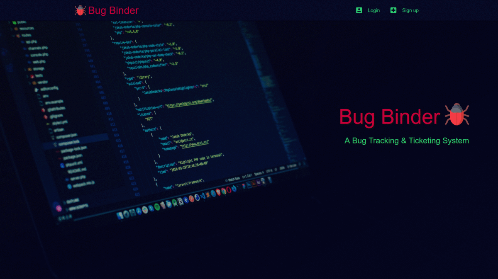

## Bug Binder

A Bug tracking and ticketing system using Django.
This is the final project for CS50's Web Programming with Python and JavaScript.
Find all previous projects <b>[here.](https://github.com/asifo1/cs50w)</b>

#### Features

1. Create project
2. Add or remove dev from project
3. Issue & track bugs
4. Assign dev to an issue
5. Public bug issue url
6. Developer's profile

#### Files & Directories

- `Main Directory`
  - `bugbinder` - Main application directory.
    - `_auth` - Authentication app with login, sign up and reset password.
    - `_profile` - Profile app for maintaining prolife.
    - `bugbinder` - Containes settings and main url file.
    - `core` - Core app for all functionalities like create project, assign task etc.
    - `static` - Holds all static files.
      - `css` - Contain all css files for styling the website.
      - `js` - Contain all JavaScript files for manipulating the DOM with ajax functionalities.
      - `img` - Holds all static images and icons.
    - `Templates` - Holds all html files.
  - `gitignore` - Ignored files for git.
  - `Pipfile` - Project dependencies.

#### Preview

